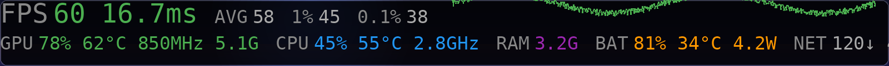
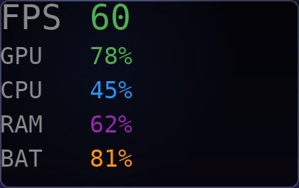
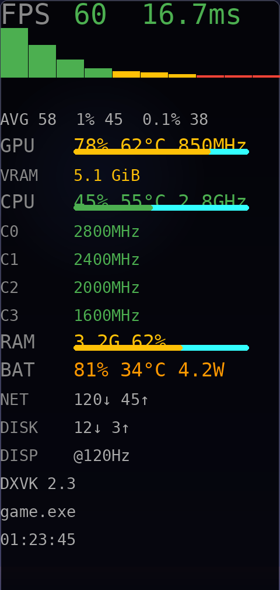
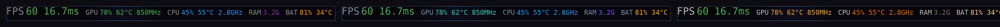
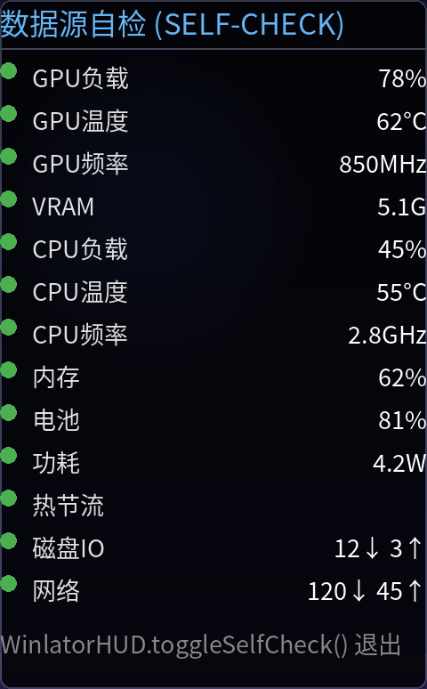

# WinlatorHUD

[](https://opensource.org/licenses/MIT)
[](https://developer.android.com)
[](https://github.com/brunodev85/winlator)

> 基于 Android View 渲染管线的 Winlator 性能监控叠加层 — 零 Vulkan layer 依赖，零闪烁，单文件自包含。

## 效果预览

### 横向横条（顶部）

| 精简 | 标准 |
|------|------|
|  |  |

详细模式（含帧时间波形图、引擎与进程信息）：



### 竖向竖列（侧边）

| 精简 | 详细 |
|------|------|
|  |  |

详细模式含帧时间直方图、GPU/CPU/RAM 仪表盘进度条、逐核心频率、热节流与磁盘 I/O。

### 主题（默认蓝 / 暗夜绿 / 暖橙）



### 数据源自检面板（v3.8）

每个数据源以绿/黄/红指示灯标出读取状态，集成后能一眼看出哪些值被系统权限拦截：



## 技术架构

WinlatorHUD 采用 Android UI 层叠加方案，在 SurfaceFlinger 合成阶段独立绘制监控面板，不介入 Vulkan/OpenGL 渲染管线。这一架构从根本上规避了 Vulkan layer 注入方案在 Wine present 机制下的帧同步冲突（表现为闪烁、黑屏或闪退）。

### 核心技术栈

| 模块 | 实现方式 |
|------|----------|
| 渲染层 | android.view.View + Canvas 硬件加速绘制 |
| 数据采集 | 独立 HandlerThread，500ms 采样周期，不阻塞渲染线程 |
| 文本渲染 | 预格式化到可复用 StringBuilder，运行时零 GC 分配 |
| 帧统计 | 滑动窗口帧时间队列，支持 1% Low / 0.1% Low / stale 帧检测 |
| 布局引擎 | 横屏双列 / 竖屏单列自适应，位掩码控制元素可见性 |
| 交互系统 | 单击循环密度、双击切换方向、拖拽位移、长按锁定 |

### 数据采集能力

- GPU 子系统：多厂商 sysfs 节点自动发现（Adreno / Mali / PowerVR / MediaTek / Exynos，共 16+ 探测路径），支持使用率、频率、温度、显存三模式探测（kgsl own-pid / sysfs / ActivityManager）
- CPU 子系统：全局使用率 + 每核心频率 + thermal zone 优先级排序
- 内存子系统：/proc/meminfo 实时解析 + Swap 统计
- 电源管理：BatteryManager 状态监听 + 剩余时间指数平滑预测（alpha=0.65）
- 显示子系统：DisplayManager 刷新率实时同步（@120Hz 等）
- 网络子系统：TrafficStats 累计流量统计

## 快速集成

### AAR 依赖（推荐）

从 Releases 下载最新 AAR，放入 app/libs/：

```gradle
dependencies {
    implementation files('libs/WinlatorHUD-3.6.0.aar')
}
```

### 源码集成（零依赖）

复制 WinlatorHUD.java 到目标项目的 com.winlator.hud 包下，无需任何额外配置。

### 初始化

```java
// XServerDisplayActivity.onCreate 中
WinlatorHUD.init(this);

// 渲染循环中（vkQueuePresentKHR / eglSwapBuffers 之后）
WinlatorHUD.recordFrame();

// 可选：设置容器信息
WinlatorHUD.setGameInfo("DXVK", "1920x1080", "Wine 9.0");

// v3.1+ 帧生成支持（LSFG / FSR FG 开启时调用）
// recordFrame() 统计游戏渲染FPS，setPresentedFps() 传入实际显示FPS
WinlatorHUD.setPresentedFps(displayFps);

// v3.2+ DX 版本（MEGA 模式显示）
WinlatorHUD.setDxVersion("DX11");

// v3.2+ 可配置外观（可选，默认已持久化）
WinlatorHUD.setBgAlpha(0xCC);       // 背景透明度 0-255
WinlatorHUD.setOutlineIntensity(0.4f); // 描边强度 0-1

// v3.5+ 主题配色（默认蓝 / 暗夜绿 / 暖橙）
WinlatorHUD.setTheme(WinlatorHUD.THEME_GREEN);

// v3.1+ 诊断导出（排查"指标读不到"时使用）
File diag = WinlatorHUD.exportDiagnostics(context);
// 或直接获取报告文本
String report = WinlatorHUD.buildDiagnosticsReport(context);

// v3.3+ 性能记录（CSV/JSON 导出，多项指标时间序列）
WinlatorHUD.startRecording();
// ... 游戏运行期间自动采样（默认1秒/点，IO线程零渲染开销）
File csv = WinlatorHUD.exportRecordingCSV(context);   // Excel/Origin 可直接打开
File json = WinlatorHUD.exportRecordingJSON(context); // 结构化数据
WinlatorHUD.stopRecording();
```

### 配置持久化（v3.1+）

密度模式、横/竖方向、拖拽位置自动保存到 `SharedPreferences`（`winlator_hud_prefs`），下次启动自动恢复。无需额外调用。

### 多 Fork 接入指南（v3.4+）

集成到官方 / Bionic / glibc / Ludashi / GameNative / WinNative 的精确接入点、recordFrame 调用方式、已有 HUD 共存方案，详见 [docs/INTEGRATION_GUIDE.md](docs/INTEGRATION_GUIDE.md)。

## 监控指标（24 项）

| 分类 | 指标 |
|------|------|
| 帧统计 | FPS / Frametime / 平均 FPS / 1% Low / 0.1% Low / Frametime 图表 |
| GPU | 使用率 / 温度 / 频率 / 显存 |
| CPU | 使用率 / 温度 / 频率 / 每核心详情 |
| 系统 | 内存 / Swap / 电池 / 电池剩余时间 / 网络 |
| 容器 | 渲染引擎 / 分辨率（含刷新率）/ Wine 版本 / 运行时长 / 温控状态 |

## 密度模式

| 模式 | 触发 | 内容 |
|------|------|------|
| 精简 | 单击 | FPS + GPU + CPU + RAM |
| 标准 | 单击 | 默认 14 项核心指标 |
| 详细 | 单击 | 全部 24 项 + 每核心频率 |
| MEGA | 单击 | v3.2+ 超详细：全部指标 + DX 版本 + 刷新率 |

## 构建与发布

本仓库的 setup-project.yml 同时承担项目初始化和版本发布两个职责：

- 手动触发（Actions -> Run workflow）：初始化项目结构
- 推送 tag（git tag v3.7.0 && git push --tags）：自动编译 AAR 并发布到 Releases

```bash
git tag v3.7.0
git push origin v3.7.0
```

## 兼容性

- Android: API 24 (Android 7.0) 及以上
- Winlator: 全版本（官方 / bionic / glibc / Ludashi / Bannerlator / WinNative 等 fork）
- GPU: 高通 Adreno 完全支持；Mali / PowerVR 部分指标支持

## 版本迭代

| 版本 | 状态 | 说明 |
|------|------|------|
| v3.8.0 | 当前稳定版 | 数据源自检面板（13源绿黄红状态灯）/ 本地编译验证脚本 / README 效果图 / GitHub 元数据 |
| v3.7.0 | 历史版本 | 记录扩展（21列）/ Demo App / 一键集成补丁脚本 |
| v3.6.0 | 历史版本 | 功耗三级回退 / 热节流状态 / 帧时间直方图 / 磁盘 I/O |
| v3.5.0 | 历史版本 | 动态变色 / 仪表盘进度条 / 3套主题 |
| v3.4.0 | 历史版本 | 多 Fork 接入指南 |
| v3.3.0 | 历史版本 | CSV/JSON 性能记录导出 |

## Demo App（v3.7+）

无需集成 Winlator，直接安装即可体验 HUD 全部功能。

```bash
# 编译 Demo APK
./gradlew :demo:assembleDebug

# 安装
adb install demo/build/outputs/apk/debug/demo-debug.apk
```

Demo 功能：启动 HUD / 模拟帧率（30-120 FPS 随机波动）/ 切换主题 / 释放 HUD。手势操作（单击循环密度、双击切换横竖、拖拽移动、长按锁定）全部可用。

## 一键集成补丁（v3.7+）

自动检测任意 Winlator fork 的 XServerDisplayActivity，生成集成补丁，无需手动找行号。

```bash
python3 patch/patch_winlator_hud.py /path/to/winlator-project
```

输出 `winlator-hud-auto.patch` + `PATCH_NOTES.md`，然后 `git apply` 即可。支持官方 / Bionic / glibc / Ludashi / WinNative / GameNative 等全部 fork。

## 许可证

MIT License — 详见 LICENSE

## 致谢

本项目在数据采集策略和交互模式上参考了 Winlator 社区多个开源实现的工程经验。核心渲染架构和帧统计算法为独立实现。

